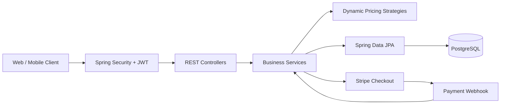
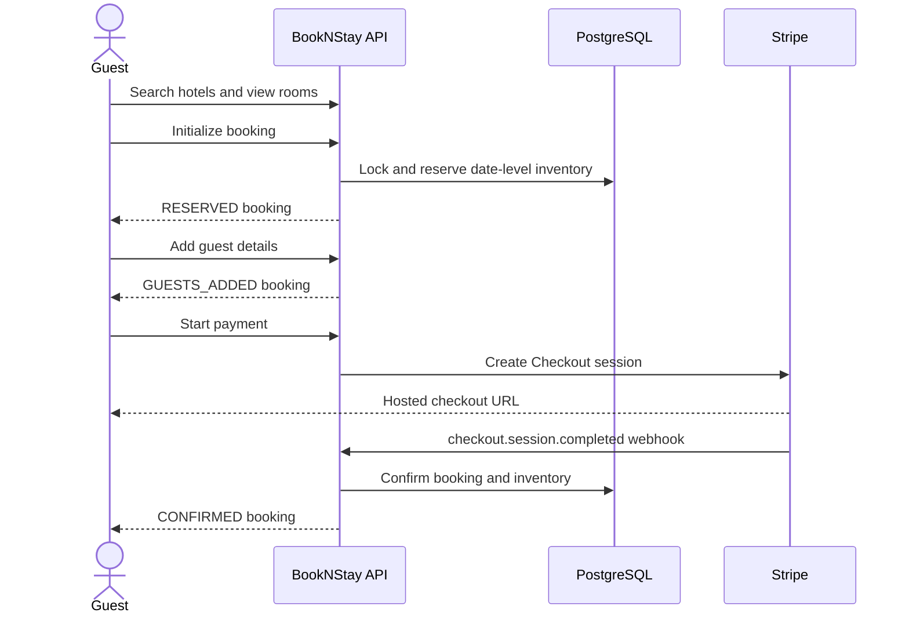

<div align="center">

# 🏨 BookNStay

### A secure, inventory-aware hotel booking and management REST API

[](https://www.oracle.com/java/)
[](https://spring.io/projects/spring-boot)
[](https://www.postgresql.org/)
[](https://stripe.com/)
[](https://maven.apache.org/)

BookNStay powers the complete hotel reservation lifecycle—from property discovery and live room inventory to secure checkout, cancellations, refunds, and owner analytics.

[Features](#-features) • [Architecture](#-architecture) • [Getting Started](#-getting-started) • [API Reference](#-api-reference) • [Booking Flow](#-booking-flow)

</div>

---

## ✨ Features

### For guests

- Account signup and login with short-lived JWT access tokens and HTTP-only refresh-token cookies
- Paginated hotel discovery by city and stay dates
- Hotel and room detail browsing
- Inventory-aware booking with pessimistic database locking to reduce overselling
- Multi-guest details for each reservation
- Stripe-hosted checkout, webhook-based confirmation, cancellation, and automatic refunds
- Booking history, booking status, profile, and saved guest management

### For hotel managers

- Create, update, activate, and delete hotels
- Add and manage room types, capacity, pricing, photos, and amenities
- Generate a full year of date-level inventory when a hotel is activated
- Open or close inventory and configure surge factors across date ranges
- View bookings for owned hotels
- Generate booking count, total revenue, and average revenue reports

### Platform capabilities

- Role-based access control for `GUEST` and `HOTEL_MANAGER`
- Dynamic pricing through composable Strategy-pattern decorators
- Hourly scheduled price and minimum-rate updates
- Consistent API response envelopes and centralized exception handling
- OpenAPI/Swagger documentation with bearer-token support
- Layered Controller → Service → Repository architecture

## 🧠 Dynamic pricing

BookNStay calculates a room's daily rate by composing multiple pricing rules:

```text
Final price = base price
            × surge factor
            × occupancy adjustment
            × urgency adjustment
            × holiday adjustment
```

The current implementation applies:

- **Surge pricing** using the manager-controlled inventory surge factor
- **Occupancy pricing** with a 20% increase above 80% occupancy
- **Urgency pricing** with a 50% increase for stays within the next seven days
- **Holiday pricing** with a 25% adjustment (currently backed by a placeholder holiday check)

Calculated inventory prices and each hotel's daily minimum price are refreshed every hour.

## 🏗 Architecture



### Project structure

```text
src/main/java/com/yashwanth/bookNstay
├── advices/      # Response envelope and global exception handling
├── config/       # ModelMapper, OpenAPI, and Stripe configuration
├── controller/   # Public, authenticated, and manager REST endpoints
├── dto/          # API request and response models
├── entity/       # JPA entities and enums
├── repository/   # Spring Data repositories and inventory queries
├── security/     # JWT authentication and authorization
├── service/      # Business interfaces and implementations
├── strategy/     # Composable dynamic-pricing rules
└── util/         # Shared application helpers
```

## 🛠 Tech stack

| Area | Technology |
|---|---|
| Language | Java 21 |
| Framework | Spring Boot 4.0.7, Spring Web MVC |
| Persistence | Spring Data JPA / Hibernate |
| Database | PostgreSQL |
| Security | Spring Security, BCrypt, JWT (`jjwt`) |
| Payments | Stripe Checkout and webhooks |
| API docs | Springdoc OpenAPI / Swagger UI |
| Mapping | ModelMapper |
| Utilities | Lombok |
| Build | Maven Wrapper |

## 🚀 Getting started

### Prerequisites

- Java 21+
- PostgreSQL
- A Stripe account and API keys
- Stripe CLI (recommended for local webhook testing)

### 1. Clone the repository

```bash
git clone https://github.com/yashwanthkumar-r/bookNstay.git
cd bookNstay
```

### 2. Create the database

```sql
CREATE DATABASE booknstay;
```

### 3. Configure the application

Create `src/main/resources/application.properties` and keep secrets outside version control:

```properties
spring.application.name=bookNstay

spring.datasource.url=${DB_URL:jdbc:postgresql://localhost:5432/booknstay}
spring.datasource.username=${DB_USERNAME:postgres}
spring.datasource.password=${DB_PASSWORD}
spring.jpa.hibernate.ddl-auto=update
spring.jpa.show-sql=true

server.servlet.context-path=/api/v1
spring.jackson.mapper.sort-properties-alphabetically=false

# Use a strong secret of at least 32 bytes for HS256 signing.
jwt.secretKey=${JWT_SECRET}

frontend.url=${FRONTEND_URL:http://localhost:8080}
stripe.secret.key=${STRIPE_SECRET_KEY}
stripe.webhook.secret=${STRIPE_WEBHOOK_SECRET}
```

Set the required environment variables in your shell or IDE before starting the API.

### 4. Run the application

macOS/Linux:

```bash
./mvnw spring-boot:run
```

Windows:

```powershell
.\mvnw.cmd spring-boot:run
```

The API will be available at:

```text
http://localhost:8080/api/v1
```

Swagger UI:

```text
http://localhost:8080/api/v1/swagger-ui/index.html
```

### 5. Forward Stripe webhooks locally

```bash
stripe listen --forward-to localhost:8080/api/v1/webhook/payment
```

Copy the generated `whsec_...` value into `STRIPE_WEBHOOK_SECRET`.

## 🔐 Authentication and roles

New accounts are assigned the `GUEST` role. After login, send the returned access token with protected requests:

```http
Authorization: Bearer <access-token>
```

Access tokens expire after 10 minutes. Refresh tokens are issued as HTTP-only cookies and are used through `POST /auth/refresh`.

All `/admin/**` routes require the `HOTEL_MANAGER` role. Because the project currently has no public manager-registration endpoint, promote a trusted user in the database or add an administrative provisioning workflow before using manager APIs.

## 📚 API reference

All routes below are relative to `/api/v1`.

### Authentication

| Method | Endpoint | Access | Description |
|---|---|---|---|
| `POST` | `/auth/signup` | Public | Create a guest account |
| `POST` | `/auth/login` | Public | Authenticate and receive an access token |
| `POST` | `/auth/refresh` | Refresh cookie | Generate a new access token |

### Hotel discovery

| Method | Endpoint | Access | Description |
|---|---|---|---|
| `GET` | `/hotels/search` | Public | Search active hotels with a paginated request body |
| `GET` | `/hotels/{hotelId}/info` | Public | Get hotel details and room types |

### Bookings

| Method | Endpoint | Access | Description |
|---|---|---|---|
| `POST` | `/bookings/init` | Guest | Reserve room inventory and initialize a booking |
| `POST` | `/bookings/{bookingId}/addGuests` | Guest | Attach guests to a reservation |
| `POST` | `/bookings/{bookingId}/payments` | Guest | Create a Stripe Checkout session |
| `POST` | `/bookings/{bookingId}/status` | Guest | Get the current booking status |
| `POST` | `/bookings/{bookingId}/cancel` | Guest | Cancel a confirmed booking and issue a refund |

### User and guest management

| Method | Endpoint | Access | Description |
|---|---|---|---|
| `GET` | `/users/profile` | Guest | Get the current profile |
| `PATCH` | `/users/profile` | Guest | Update the current profile |
| `GET` | `/users/myBookings` | Guest | List the current user's bookings |
| `GET` | `/users/guests` | Guest | List saved guests |
| `GET` | `/users/guests/{guestId}` | Guest | Get a saved guest |
| `PUT` | `/users/guests/{guestId}` | Guest | Update a saved guest |
| `DELETE` | `/users/guests/{guestId}/bookings/{bookingId}` | Guest | Remove a guest from a booking |

### Hotel administration

| Method | Endpoint | Access | Description |
|---|---|---|---|
| `POST` | `/admin/hotels` | Manager | Create a hotel |
| `GET` | `/admin/hotels` | Manager | List hotels owned by the current manager |
| `GET` | `/admin/hotels/{hotelId}` | Manager | Get an owned hotel |
| `PUT` | `/admin/hotels/{hotelId}` | Manager | Update an owned hotel |
| `DELETE` | `/admin/hotels/{hotelId}` | Manager | Delete an owned hotel |
| `PATCH` | `/admin/hotels/{hotelId}/activate` | Manager | Activate a hotel and initialize inventory |
| `GET` | `/admin/hotels/{hotelId}/bookings` | Manager | List bookings for an owned hotel |
| `GET` | `/admin/hotels/{hotelId}/reports` | Manager | Get booking and revenue metrics |

### Room and inventory administration

| Method | Endpoint | Access | Description |
|---|---|---|---|
| `POST` | `/admin/hotel/{hotelId}/rooms` | Manager | Create a room type |
| `GET` | `/admin/hotel/{hotelId}/rooms` | Manager | List room types |
| `GET` | `/admin/hotel/{hotelId}/rooms/{roomId}` | Manager | Get a room type |
| `PUT` | `/admin/hotel/{hotelId}/rooms/{roomId}` | Manager | Update a room type |
| `DELETE` | `/admin/hotel/{hotelId}/rooms/{roomId}` | Manager | Delete a room type and its inventory |
| `GET` | `/admin/inventory/rooms/{roomId}` | Manager | Get date-level inventory |
| `PATCH` | `/admin/inventory/rooms/{roomId}` | Manager | Update surge factor or availability for a date range |

### Webhooks

| Method | Endpoint | Access | Description |
|---|---|---|---|
| `POST` | `/webhook/payment` | Stripe signature | Confirm completed Checkout sessions |

## 🔄 Booking flow



Reservations should proceed to guest details and payment within 10 minutes; the service treats older pending reservations as expired during subsequent booking actions.

## 🧪 Example requests

Create an account:

```bash
curl -X POST http://localhost:8080/api/v1/auth/signup \
  -H "Content-Type: application/json" \
  -d '{
    "name": "Alex Morgan",
    "email": "alex@example.com",
    "password": "change-me"
  }'
```

Search for hotels:

```bash
curl -X GET http://localhost:8080/api/v1/hotels/search \
  -H "Content-Type: application/json" \
  -d '{
    "city": "New York",
    "startDate": "2026-08-10",
    "endDate": "2026-08-12",
    "roomsCount": 1,
    "page": 0,
    "size": 10
  }'
```

Initialize a booking:

```bash
curl -X POST http://localhost:8080/api/v1/bookings/init \
  -H "Authorization: Bearer <access-token>" \
  -H "Content-Type: application/json" \
  -d '{
    "hotelId": 1,
    "roomId": 1,
    "roomsCount": 1,
    "checkInDate": "2026-08-10",
    "checkOutDate": "2026-08-12"
  }'
```

## 📦 Build and test

```bash
./mvnw clean verify
```

Build the executable JAR without running tests:

```bash
./mvnw clean package -DskipTests
java -jar target/bookNstay-0.0.1-SNAPSHOT.jar
```

## 🤝 Contributing

Contributions are welcome. Fork the repository, create a focused branch, commit your changes, and open a pull request with a clear description and test notes.

## 👨‍💻 Author

Built by [Yashwanth Kumar](https://github.com/yashwanthkumar-r).

If this project helped you, consider giving it a ⭐ on GitHub.
